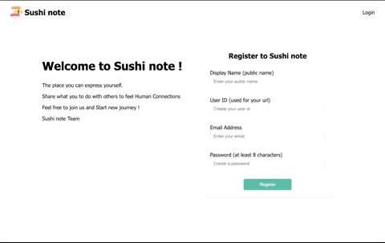

# sushi-note-app
A social network and blog web application that anyone can post and comment to it.
# What I learned
- Build a web application using Spring boot.
- Login & Email verification with Spring security.
- Practice using thymeleaf, JPA, Ajax.
# Demo

